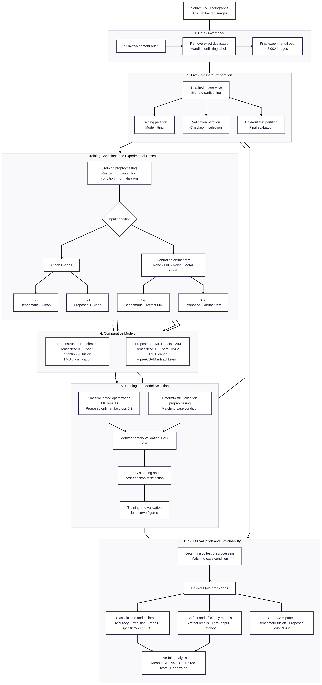

# AGML-DenseCBAM

**Attention-Guided Multi-Task Learning with DenseNet201-CBAM for Robust Temporomandibular Joint Subluxation Classification from Panoramic Radiographs under Controlled Synthetic Artifacts**

This repository contains the research software developed for a quantitative, retrospective, non-interventional computational study of temporomandibular joint (TMJ) subluxation classification. It compares a reconstructed DenseNet201 attention benchmark with the proposed Attention-Guided Multi-Task Learning DenseNet201-CBAM model under clean and controlled synthetic-artifact conditions.

The software is a research prototype. It is not a clinically validated diagnostic system.

## Study overview

The experiment uses five matched image-wise folds and four prespecified cases:

| Case | Model | Evaluation condition |
|---|---|---|
| C1 | Reconstructed DenseNet201 attention benchmark | Clean |
| C2 | Reconstructed DenseNet201 attention benchmark | Controlled artifact mix |
| C3 | Proposed AGML-DenseCBAM | Clean |
| C4 | Proposed AGML-DenseCBAM | Controlled artifact mix |

The proposed model uses a shared ImageNet-pretrained DenseNet201 encoder. Its primary branch applies Convolutional Block Attention Module (CBAM) channel and spatial attention for Normal/Subluxation classification. Its auxiliary branch classifies four input conditions from pre-CBAM features: none, motion blur, Gaussian noise, and metal streak.



## Final V2 results

Values are the mean ± sample standard deviation across five matched folds.

| Case | Accuracy | F1-score |
|---|---:|---:|
| C1 — Benchmark, clean | 89.21% ± 2.20% | 90.07% ± 1.96% |
| C2 — Benchmark, artifact mix | 88.94% ± 1.00% | 89.89% ± 1.00% |
| C3 — Proposed, clean | 89.44% ± 1.57% | 90.29% ± 1.44% |
| C4 — Proposed, artifact mix | **90.27% ± 1.44%** | **91.15% ± 1.26%** |

Under the prespecified unadjusted one-tailed paired analysis, C4 exceeded C2 for accuracy (`p = 0.0112`, Cohen's `dz = 1.616`) and F1-score (`p = 0.0137`, Cohen's `dz = 1.519`). Clean-condition differences, other primary metrics, and separate robustness-gain comparisons were not statistically significant. Neither significant result crosses a conservative Bonferroni threshold of 0.01 if all five classification metrics are treated as one family.

See [`docs/TECHNICAL_NOTES.md`](docs/TECHNICAL_NOTES.md) for the complete methodological and statistical interpretation.

## Repository structure

```text
base/          Released base-study notebook retained for provenance
notebooks/     Thin notebook interface to the active scripts
scripts/       Dataset, training, analysis, learning-curve, and Grad-CAM tools
tests/         Integrity and reproducibility tests
docs/          Architecture, technical notes, and operating guide
results/       Locally generated outputs; excluded from version control
data/          Source images; excluded from version control
data_5_fold/   Generated fold data and manifests; excluded from version control
```

The active implementation is under `scripts/`. Files under `base/` are provenance artifacts and are not the active training pipeline.

## Reproducibility

The final environment was verified in WSL2 with Python 3.13.13, TensorFlow 2.21.0, and an NVIDIA GeForce RTX 4050 Laptop GPU. Exact package versions are recorded in `requirements.txt`.

```bash
python -m pip install -r requirements.txt
python scripts/check_tf_gpu.py
python -m unittest discover -s tests -v
```

A new four-case reproduction should be written to a separate directory so that preserved outputs are not overwritten. Complete commands are provided in [`docs/GUIDE.md`](docs/GUIDE.md).

The repository records:

- exact-content SHA-256 auditing and deduplication;
- fold manifests and split-integrity checks;
- deterministic seeds and synthetic-artifact rules;
- training-script, runner-script, configuration, checkpoint, and input fingerprints;
- fold-level predictions, confusion matrices, learning histories, and metrics; and
- paired statistical analysis and deterministic Grad-CAM sample selection.

This organization follows the transparency and documentation principles in the [IEEE Research Reproducibility guidance](https://journals.ieeeauthorcenter.ieee.org/create-your-ieee-journal-article/research-reproducibility/) and the [ML Code Completeness Checklist](https://github.com/paperswithcode/releasing-research-code).

## Data governance

The local source collection contained 3,425 extracted images. Exact-content auditing identified 3,010 unique images, 361 duplicate groups, 415 additional copies, and eight contradictory-label groups involving 17 files. The completed computational experiment used 3,002 unique, non-conflicting images.

The repository does not modify the source `data/` directory. Fold generation stops when contradictory labels are detected unless the explicit exclusion policy is selected. Formal reporting still requires adviser or research-governance approval and documentation of that exclusion decision.

Patient identifiers and original-panorama provenance were not supplied. Exact-file leakage is prevented, but patient-level independence cannot be guaranteed. The source images and generated folds are therefore excluded from version control.

## Interpretation limits

- Cross-validation is image-wise, not patient-wise.
- The benchmark is a reconstruction from the publication and released notebook, not a direct reproduction using unavailable original folds or weights.
- Synthetic artifacts are controlled computational stress tests, not clinically annotated or physically validated acquisition artifacts.
- Grad-CAM outputs are qualitative unless independently prepared expert regions of interest are available.
- Five paired folds provide limited power for normality and inferential testing.
- The proposed model showed an artifact-condition accuracy and F1 advantage, but no overall speed advantage.
- Ethical or exempt-review status must be determined by the relevant institutional review body; this repository does not imply retroactive approval.

## Documentation

- [`docs/GUIDE.md`](docs/GUIDE.md) — installation, data preparation, reproduction, analysis, and appendix generation
- [`docs/TECHNICAL_NOTES.md`](docs/TECHNICAL_NOTES.md) — methods, provenance, parameters, results, statistics, and limitations
- [`docs/SYSTEM_ARCHITECTURE.md`](docs/SYSTEM_ARCHITECTURE.md) — complete pipeline and proposed-model architecture

## Result preservation and availability

The original V1 pilot is preserved by Git tag `pilot-v1`. Local V1 and final V2 outputs are stored under `results/final_3002_seed42/` and `results/final_v2/`, respectively, with tracked checksum manifests.

A clean clone contains the code, documentation, reported result tables, and checksum inventories, but not the source radiographs, generated folds, trained checkpoints, or full result archive. These larger or governed artifacts must be restored separately under their documented paths or regenerated from authorized source data. New runs should use `results/reproduction_v2/` or another clearly named directory; regenerated figures and analyses should use `results/regenerated/` so preserved checksums remain unchanged.
