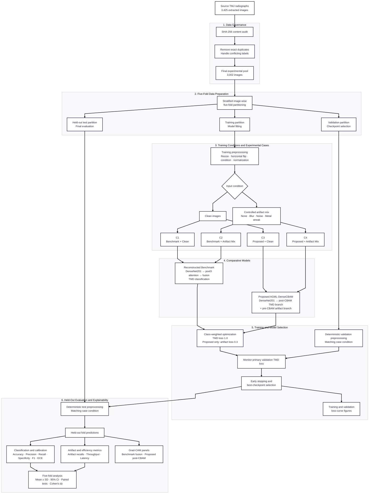
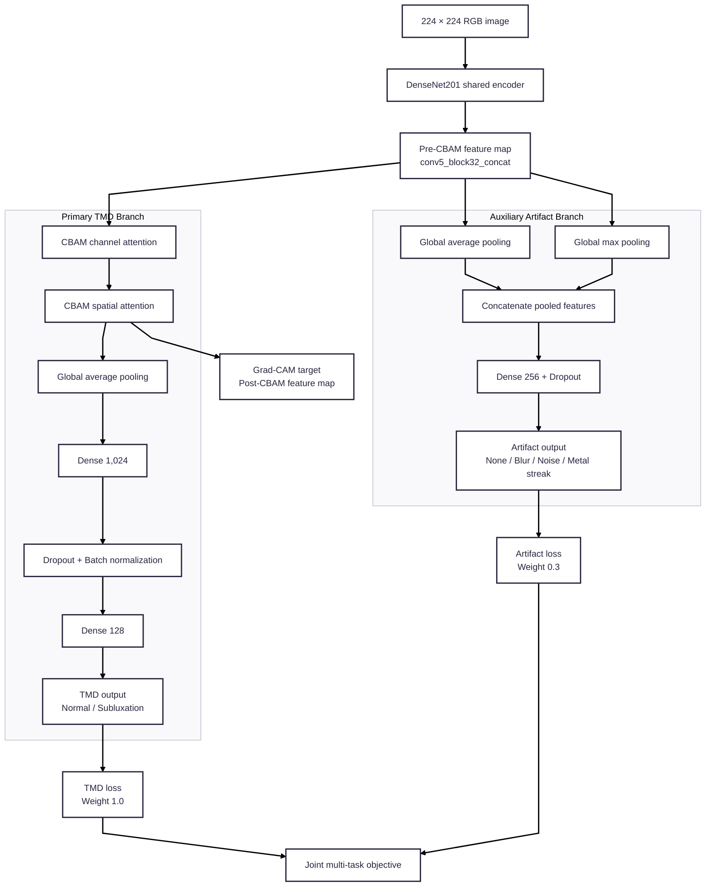

# System Architecture

This document presents the completed AGML-DenseCBAM V2 experimental pipeline and proposed-model architecture. The Mermaid sources use the `dagre` layout, `redux` theme, and `linear` connectors so arrows contain straight segments and sharp turns.

## Rendered exports

| Figure | PNG for Word/thesis | Scalable SVG |
|---|---|---|
| Complete V2 system architecture | [`system_architecture_v2.png`](figures/system_architecture_v2.png) | [`system_architecture_v2.svg`](figures/system_architecture_v2.svg) |
| Proposed model architecture | [`proposed_model_architecture_v2.png`](figures/proposed_model_architecture_v2.png) | [`proposed_model_architecture_v2.svg`](figures/proposed_model_architecture_v2.svg) |

## Main system architecture

## Proposed model detail

Use this figure when the chapter needs a dedicated architecture diagram for the proposed network rather than the entire experimental pipeline.

## Figure captions

### Main architecture

**Figure X. System architecture of the AGML-DenseCBAM experimental pipeline.** Existing TMJ radiographic images undergo exact-content auditing, conflicting-label handling, and stratified image-wise five-fold preparation. Identical clean and controlled synthetic-artifact conditions are supplied to the reconstructed DenseNet201 attention benchmark and proposed AGML-DenseCBAM model. Checkpoints are selected using primary validation TMD loss before evaluation on the held-out fold. Outputs include classification, calibration, artifact, efficiency, statistical, learning-curve, and Grad-CAM results.

### Proposed model

**Figure Y. Architecture of the proposed AGML-DenseCBAM model.** A DenseNet201 encoder produces a shared pre-CBAM feature representation. The primary branch applies CBAM channel and spatial attention before TMD classification. The auxiliary branch pools pre-CBAM features using global average and maximum pooling for controlled-artifact classification. The two tasks are jointly optimized using TMD and artifact loss weights of 1.0 and 0.3, respectively.

## Module-by-module explanation

### Module 1 — Data Governance

**Purpose.** This module establishes the traceable experimental dataset before model development begins. It prevents exact copies of an image from appearing as apparently independent observations and identifies contradictory labels that would make the learning target internally inconsistent.

**Input.** The module receives the 3,425 locally available extracted TMJ radiographic images assigned to the Normal and Subluxation classes.

**Process.** Each file is read byte-for-byte and assigned a SHA-256 content hash. Files with the same exact file content are grouped even when their filenames or source folders differ. Same-label copies are represented only once in the experimental pool. Exact-image groups carrying both labels are recorded in the duplicate audit and handled according to the prespecified strict conflict policy. The original `data/` directory is not modified. Exclusion of the 17 contradictory-label files requires explicit documentation or approval before results are treated as formally reportable.

**Output.** The module produces an auditable pool of 3,002 unique, non-conflicting images, together with the duplicate/conflict audit and reproducibility manifests used by subsequent modules.

**Control.** This module prevents exact-content leakage and contradictory supervision. It cannot establish patient identity or original-panorama identity because those provenance fields were not supplied.

### Module 2 — Five-Fold Data Preparation

**Purpose.** This module creates a common and reproducible evaluation structure for all four experimental cases.

**Input.** The input is the 3,002-image audited pool from Module 1.

**Process.** Images are stratified by TMD class across five image-wise outer folds. In each iteration, one outer fold is reserved for held-out testing. A validation subset is derived only from the remaining outer-training partition, leaving the rest for model fitting. Exact-content groups are kept within a single split, and integrity checks confirm that training, validation, and test manifests do not overlap. The benchmark and proposed model use the same fold manifests.

**Output.** For every fold, the module provides separate training, validation, and held-out test partitions. Training data are used for optimization, validation data are used for learning-rate adjustment, early stopping, and checkpoint selection, and test data are used only after model selection.

**Control.** This is image-wise rather than patient-wise cross-validation. Patient-level separation cannot be claimed because patient and original-panorama identifiers are unavailable.

### Module 3 — Training Conditions and Experimental Cases

**Purpose.** This module applies the controlled input condition and maps each image stream to one of the four comparison cases.

**Input.** It receives the fold-specific partitions from Module 2.

**Process.** Images are resized to 224 × 224 RGB and normalized using the DenseNet preprocessing function. Training images use a seeded horizontal flip with probability 0.5. In clean cases, the input remains free of synthetic corruption. In artifact-mix cases, a seeded procedure assigns one of four conditions: none, motion blur, Gaussian noise, or metal streak. The TMD diagnosis label is retained, while the corruption category becomes the auxiliary artifact target for the proposed model. Artifact parameters are locked by the V2 protocol and applied reproducibly.

**Experimental mapping.** C1 sends clean inputs to the reconstructed benchmark; C2 sends artifact-mix inputs to the benchmark; C3 sends clean inputs to the proposed model; and C4 sends artifact-mix inputs to the proposed model. Corresponding benchmark and proposed cases use identical folds and input-condition rules.

**Output.** The module supplies model-ready tensors, TMD labels, and, for the proposed model, artifact labels.

**Control.** The generated corruptions are controlled computational stress tests. They must not be described as clinically annotated or clinically validated acquisition artifacts.

### Module 4 — Comparative Models

**Purpose.** This module implements the reconstructed benchmark and the proposed AGML-DenseCBAM network under matched experimental conditions.

**Reconstructed benchmark.** ImageNet-pretrained DenseNet201 produces deep image features. A connected attention path uses the `pool3` representation, and its output is fused with the final DenseNet representation before the Normal/Subluxation classifier. It is described as a reconstruction because the released base notebook did not contain the reported five-fold loop and overwrote rather than connected its calculated attention tensor.

**Proposed model.** ImageNet-pretrained DenseNet201 acts as a shared encoder. The primary branch sends the final feature map through CBAM channel attention and spatial attention before global pooling and TMD classification. The auxiliary branch reads the pre-CBAM feature map and combines global-average and global-maximum pooling so localized corruption evidence is less likely to be suppressed by TMD-focused attention. It then predicts none, motion blur, Gaussian noise, or metal streak.

**Output.** Both models produce Normal/Subluxation probabilities. The proposed model additionally produces four-class artifact probabilities.

**Control.** Model comparisons use the same folds, image conditions, training budget, hardware, and primary checkpoint criterion. The benchmark is not described as an exact reproduction of unavailable original folds or weights.

### Module 5 — Training and Model Selection

**Purpose.** This module fits each fold model without allowing the held-out test partition to influence parameter updates or checkpoint selection.

**Process.** V2 uses Adam, batch size 8, initial learning rate `1e-4`, a maximum of 50 epochs, balanced TMD class weights, mixed precision, and dense-layer L2 strength `1e-2`. Reduce-on-plateau lowers the learning rate by a factor of 0.1 after three non-improving epochs, down to `1e-6`. Early stopping uses patience 5. For the proposed model, the joint objective is the TMD loss multiplied by 1.0 plus the artifact loss multiplied by 0.3, together with regularization losses. The benchmark optimizes its TMD objective under the same primary training controls.

**Selection rule.** The primary validation TMD loss is the checkpoint monitor for both models. The checkpoint with the lowest monitored validation loss is restored for evaluation. Test accuracy, test F1, and Grad-CAM appearance are not checkpoint-selection criteria.

**Output.** Each fold produces a best checkpoint, numerical training history, training/validation loss figure, run configuration, and provenance fingerprints.

**Control.** Training TMD loss uses balanced class sample weights while validation TMD loss is unweighted. Consequently, their numerical gap should not be interpreted solely as an overfitting measure.

### Module 6 — Held-Out Evaluation and Explainability

**Purpose.** This module measures model performance and produces statistical and qualitative outputs only after checkpoint selection is complete.

**Process.** The selected checkpoint predicts the held-out partition under the case-matched clean or artifact condition. TMD evaluation includes accuracy, precision, recall, specificity, F1-score, confusion matrices, and 10-bin expected calibration error. Proposed-model artifact evaluation includes accuracy, macro-F1, confusion matrices, and per-artifact recall. Throughput and latency characterize computational cost. Fold-level results are summarized using mean, sample standard deviation, and 95% confidence intervals. Prespecified paired comparisons use the Shapiro–Wilk decision rule, paired tests, p-values, and Cohen's `dz` effect sizes.

**Explainability.** Grad-CAM is generated from benchmark fusion features and proposed post-CBAM features. Deterministically selected paired examples permit benchmark/proposed visual comparison without manually choosing favorable images.

**Output.** This module produces fold prediction tables, metric summaries, statistical comparisons, confusion matrices, learning-curve references, individual Grad-CAM panels, and paired Grad-CAM comparisons for Chapter IV and the appendices.

**Control.** Grad-CAM is qualitative unless independently prepared expert regions of interest are available. Evaluation results describe a research prototype and do not establish clinical diagnostic validity.

## Experimental case mapping

| Case | Model | Condition | Evaluated outputs |
|---|---|---|---|
| C1 | Reconstructed benchmark | Clean | TMD classification |
| C2 | Reconstructed benchmark | Controlled artifact mix | TMD classification |
| C3 | Proposed AGML-DenseCBAM | Clean | TMD classification; auxiliary target is `none` |
| C4 | Proposed AGML-DenseCBAM | Controlled artifact mix | TMD and four-class synthetic-artifact classification |

## Design rules for redrawing

1. Preserve the six numbered stages in the main figure.
2. Use only straight connectors or sharp straight-segment turns; do not use curved connectors.
3. Keep training, validation, and held-out test routes visibly separate.
4. Do not route the held-out test partition into optimization or checkpoint selection.
5. Keep the primary TMD branch post-CBAM and the auxiliary artifact branch pre-CBAM.

## Interpretation safeguards

1. Splitting is image-wise because patient and original-panorama identifiers were unavailable.
2. Exact-image leakage is prevented, but patient-level independence cannot be guaranteed.
3. Artifact categories are controlled synthetic corruptions, not clinically annotated acquisition artifacts.
4. Grad-CAM is qualitative unless independent expert ROI annotations are supplied.
5. The system is a research prototype, not a clinically validated diagnostic system.
