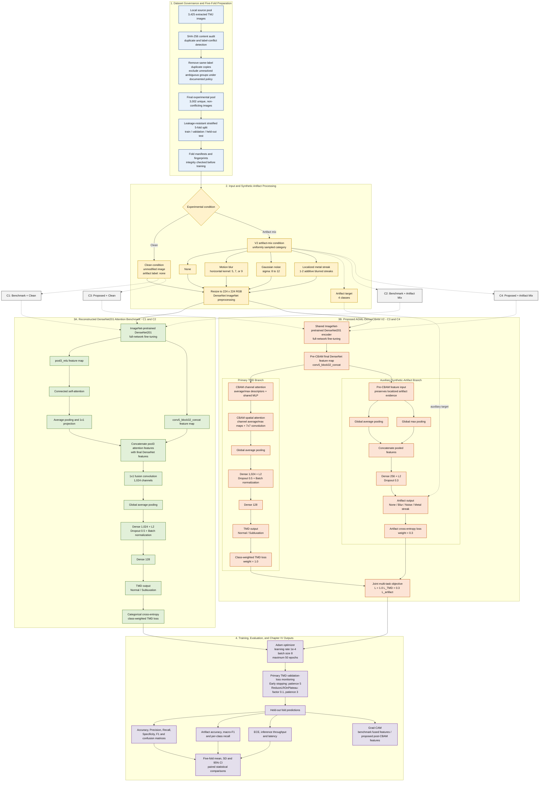

# Updated AGML-DenseCBAM System Architecture (V2)

The following Mermaid code reflects the final V2 implementation used for the completed five-fold experiment. It can be copied directly into a Mermaid-compatible Markdown editor or the Mermaid Live Editor.

## Figure caption

**Figure X. Updated system architecture of the proposed AGML-DenseCBAM V2 framework and reconstructed DenseNet201 attention benchmark.** The common five-fold pipeline applies identical data partitions, preprocessing, and synthetic artifact conditions to both architectures. The proposed model uses a shared DenseNet201 encoder, a post-CBAM primary TMD classification branch, and a pre-CBAM auxiliary artifact branch with combined global average and max pooling. The multi-task objective combines the class-weighted TMD loss and synthetic-artifact classification loss using weights of 1.0 and 0.3, respectively.

## Experimental case mapping

| Case | Architecture | Input condition | Outputs used for evaluation |
|---|---|---|---|
| C1 | Reconstructed DenseNet201 attention benchmark | Clean | TMD classification |
| C2 | Reconstructed DenseNet201 attention benchmark | V2 artifact mix | TMD classification |
| C3 | Proposed AGML-DenseCBAM V2 | Clean | TMD classification; artifact output is trivially none |
| C4 | Proposed AGML-DenseCBAM V2 | V2 artifact mix | TMD and four-class synthetic-artifact classification |

## Implementation safeguards to mention in the paper

1. The artifact categories are controlled **synthetic corruptions**, not independently annotated real clinical acquisition artifacts.
2. The local experimental pool contains 3,002 unique, non-conflicting images after exact-content auditing and documented exclusion of unresolved ambiguous groups; the source `data/` directory remains unchanged. State separately whether adviser/domain approval was obtained.
3. Patient identifiers were unavailable, so exact-image leakage is prevented but patient-level independence cannot be guaranteed.
4. Benchmark and proposed models use identical folds, input conditions, optimizer settings, batch size, and training hardware.
5. The artifact branch enters before CBAM because development-only validation showed that post-CBAM global-average features suppressed or erased localized streak evidence.
6. Grad-CAM is qualitative unless independently prepared expert ROI annotations are available.
