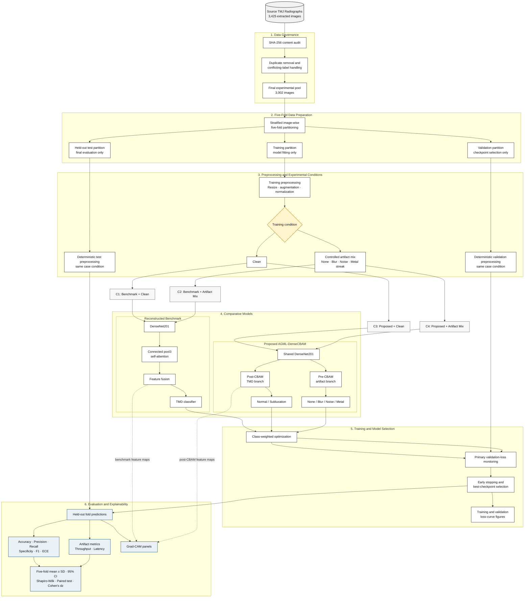
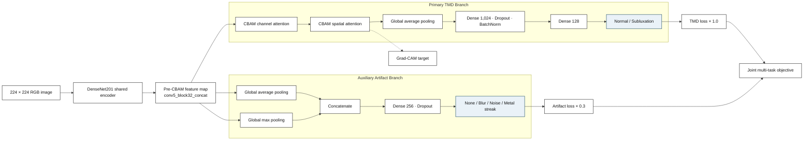

# Clean AGML-DenseCBAM System Architecture

This version is intentionally simplified for a thesis figure. It follows the vertical, stage-based layout of the provided examples while retaining the components that are methodologically necessary. The primary diagram reflects the completed V2 experiment. The exploratory V3 training schedule changes optimization and augmentation, not the model's inference architecture.

## Main system architecture

## Proposed model detail

This second diagram can be used as a model-architecture figure when the main system diagram is too high-level.

## Figure caption

**Figure X. System architecture of the AGML-DenseCBAM research pipeline.** Existing TMJ radiographic images undergo exact-content auditing, conflicting-label handling, and stratified image-wise five-fold preparation. Identical clean and controlled synthetic-artifact conditions are supplied to the reconstructed DenseNet201 attention benchmark and proposed AGML-DenseCBAM model. The proposed model uses a shared DenseNet201 encoder, a post-CBAM primary TMD branch, and a pre-CBAM auxiliary artifact branch. Best checkpoints are selected using primary validation TMD loss. Held-out predictions are evaluated using classification, calibration, artifact, and efficiency metrics, while Grad-CAM provides qualitative model-attention visualizations.

## Experimental case mapping

| Case | Model | Condition | Evaluated outputs |
|---|---|---|---|
| C1 | Reconstructed benchmark | Clean | TMD classification |
| C2 | Reconstructed benchmark | Artifact mix | TMD classification |
| C3 | Proposed AGML-DenseCBAM | Clean | TMD classification; auxiliary target is `none` |
| C4 | Proposed AGML-DenseCBAM | Artifact mix | TMD and four-class synthetic-artifact classification |

## Important interpretation notes

1. The split is image-wise because patient and original-panorama identifiers were unavailable.
2. Exact-image leakage is prevented, but patient-level independence cannot be guaranteed.
3. Artifact categories are controlled synthetic corruptions, not clinically annotated real acquisition artifacts.
4. Grad-CAM is qualitative unless independently prepared expert ROI annotations are supplied.
5. The V3 two-stage training extension does not change the proposed inference graph shown above. It changes training-only augmentation and which DenseNet layers are trainable during each optimization stage.
